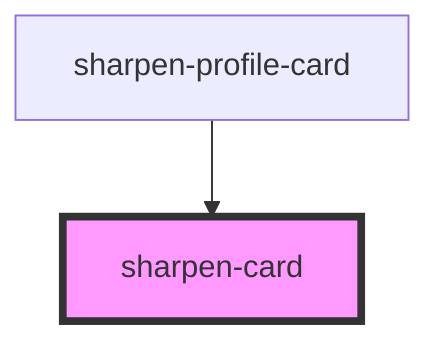

# sharpen-card

<!-- Auto Generated Below -->

## Properties

| Property  | Attribute | Description  | Type                                       | Default   |
| --------- | --------- | ------------ | ------------------------------------------ | --------- |
| `border`  | `border`  | Border style | `"gray" \| "none"`                         | `'none'`  |
| `padding` | `padding` | Padding size | `"large" \| "medium" \| "none" \| "small"` | `'small'` |

## Dependencies

### Used by

 - [sharpen-profile-card](../sharpen-profile-card)

### Graph

----------------------------------------------

*Built with [StencilJS](https://stenciljs.com/)*
